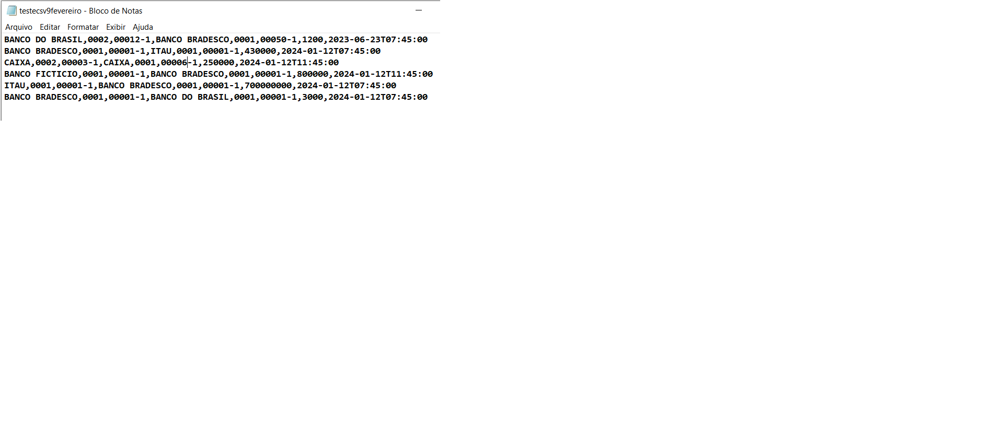
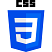
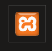

<h1 align="center"><strong>Refatoração do codigo feito no Chalenge Backend 3 da Alura para ficar no padrão MVC</strong></h1>

Abaixo o link do site deste projeto refatorado

http://analisesdetransacoesmvc.crismgsp.com/login/index
 
usuario: admin@email.com.br    senha: 123999  

OBS: meu foco neste projeto não é na parte visual, mas para ficar aceitavel usei um pouco de css inline, no anterior estava 
um pouco melhor esta parte mas pelas mudanças que fiz aqui tive uns probleminhas para acessar os arquivos css separadamente e achei mais 
facil colocar o css inline, tambem uso Bootstrap, mas não sei muito sobre isso, talvez futuramente eu melhore isso, caso haja necessidade de eu aprender mais, no momento preciso focar em outros aprendizados. 

<strong>Melhorias em relação ao original:</strong> 
Apesar da aparência ter ficado um pouco menos interessante agora, este projeto teve uma correção na lógica de mostrar as agencias suspeitas, para excluir o usuário de forma lógica ficou mais prático e seguro, para criar usuário tirei a opção de inserir o status...e já é colocado automaticamente como ativo (1), ficou mais fácil para outros usuários entenderem o meu código por estar em um padrão mais usado. <strong>Refatorei o código dividindo melhor cada parte, para ficar no padrao MVC e usei o composer para facilitar a parte de autoload.</strong>

(Resumo) O objetivo do chalenge que participei em maio de 2022 foi criar um sistema com as seguintes opções: parte dos usuários: login e logout de usuarios, um lugar no sistema pra cadastrar, editar e excluir os usuários de forma lógica (sem excluir de verdade, apenas deixar inativo, não pode fazer login). Parte das transações financeiras: No sistema tem que ter um local para fazer upload de arquivos no formato csv (e xml tambem), este arquivo ao passar pelas validações irá ser cadastrado no banco de dados criado para o projeto. Também há uma tela onde é possível ver as importações feitas e um botão em cada linha que direciona para uma tela que detalha cada importação. 
O projeto original está no repositorio:  https://github.com/crismgsp/alurachalengeback3. 
e o link para acessar o site do projeto original é: 
https://analisesdetransacoes.crismgsp.com/      
usuario: admin@email.com.br    senha: 123999  

Exemplo de arquivo CSV que funciona para importar (observar como deve ficar a data)

 

Alguns arquivos mais genericos, aproveitei de um curso que estou fazendo e o link 
deste curso que é muito completo e o professor ensina muitas coisas detalhadamente e explica o porque de se fazer assim é: 
https://celke.com.br/curso/sistema-administrativo-com-nivel-de-acesso  
Os arquivos específicos deste projeto aproveitei os do projeto que eu fiz anteriormente,  apenas alterei para ficar no padrao MVC 
utilizando conhecimentos aqduiridos neste curso acima, na plataforma da Alura, e em pesquisas na internet. 
 

<strong>O que tem neste projeto  (de forma mais detalhada que no resumo):</strong>

<strong>Banco de dados:</strong> Um banco de dados com 2 tabelas, uma pra armazenar as informações dos usuários e outra pra armazenar as informações das importações 

<strong>Tela inicial, que é a mesma do login:</strong> onde o usuario acessa o formulário de  login para acessar outras telas, o usuario digita login e senha, e os dados sao checados no banco de dados, se tiver tudo ok,e o status do usuario for 1, o login é efetuado. Após fazer o login todas as telas acessadas terão um menu para as principais opções e também tem a opção de logout. 

<strong>Tela de importacões:</strong>Ao fazer o login o usuario e direcionado para uma tela onde pode importar transacoes, por enquanto somente no formato csv, tem as seguintes validações antes de importar o arquivo no moemnto: faz uma checagem se o arquivo
está no formato csv e se ainda não existe a data da primeira linha do arquivo do upload no banco de dados . Ao importar estas tabelas elas vao para o banco de dados, onde também sao inseridos (além dos dados do arquivo importado) o horario e a data  de importação e o usuario logado em colunas especificas. 

<strong>Tela de importacões feitas:</strong> Nesta tela da para ver as datas das transacoes e a data de importacao das importacoes que ja foram feitas, e na frente de cada tem um link, que quando o usuario clica, puxa os dados do banco de dados e mostra todas as colunas daquela transacao especifica, elas ficam na tela de transacoes detalhadas 

<strong>Tela de transações suspeitas:</strong> Nesta tela aparecem as transacoes suspeitas, na tela de cima a pessoa escolhe um mes e clica no botão,  caso tenha sido feita uma transação com valor maior do que 100.000 aparece na tela do mes da transacao, caso uma conta bancaria tenha feito no mes todo transacoes (tanto de entrada como de saida) no valor total maior que 1000000 aparece na tabela abaixo, e caso a soma total de transacoes de uma agencia seja maior que 1 bilhao no mes aparece na terceira tabela desta pagina. 

<strong>Cadastrar usuarios</strong> Nesta tela, tem um formulario, em que é possivel para o usuario logado, cadastrar outro usuario, digitando, nome, email, status e senha. Esta senha fica criptografada no banco de dados.  

<strong>Usuarios cadastrados</strong> Nesta tela aparecem todos os usuarios cadastrados, e há na frente de cada nome os botoes editar e excluir que levam para outras telas, no caso do editar é possivel editar nome e email , e no caso do botao excluir ocorre uma "exclusão lógica", pois foi colocado nas regras de negocio para nao excluir totalmente o usuario para nao gerar problemas caso o usuario tenha postado tabelas, o nome dele ser puxado do banco de dados normalmente, mas nesta exclusão lógica o usuario não pode mais fazer login. O usuário não pode se excluir e nenhum usuário pode excluir, nem editar o Admin.
 

<strong>Ferramentas e linguagens utilizadas até agora:</strong>

 PHP 

 HTML 

 CSS 

 Banco de dados MariaDB 

PHPMyAdmin (pra acessar o MariaDB)  

 Visual Studio Code 

 XAMPP   

 Composer   

Referencias das imagens para credito:

PHP -> https://www.flaticon.com/br/icones-gratis/php

HTML -> https://www.flaticon.com/free-icons/html

CSS -> https://www.flaticon.com/free-icons/css-3
 

